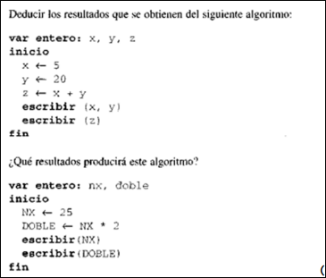

# Ejercicios C++ - Primera asignacion

## Ejercicio 1

## Ejercicio 2
Realice un programa que retorne la suma de los diez primeros números pares. 

## Ejercicio 3
Realice un programa que reciba 10 números por teclado y retorne su suma.

## Ejercicio 4
Escribir un algoritmo que lea un número y escriba su raíz cuadrada, su valor si se potencia a la 2, a la 3 y a la 5.

## Ejercicio 5
Realice un programa que calcule el promedio de 5 notas ingresadas por teclado y, basado en ese promedio, si es mayor que 10, retorne el mensaje: “Usted está aprobado + SU NOMBRE”, de lo contrario retorne: “Usted está reprobado + SU NOMBRE”.

## Ejercicio 6
Se trata de escribir el algoritmo que permita emitir la factura correspondiente a una compra de un artículo determinado, del que se adquieren una o varias unidades. El IVA a aplicar es del 16% y si el precio bruto (precio venta más IVA) es mayor de 54.300Bs, se debe realizar un descuento del 10%. La factura a mostrar en pantalla debe incluir:
    1. Su nombre (El de usted, no uno ingresado por teclado).
    2. SubTotal
    3. IVA
    4. Descuento
    5. Total.

## Ejercicio 7
Realice un programa que reciba la tasa del dólar del día (BCV) en Bs y un valor monetario en `$` y retorne la conversión. Ej: Tasa:189,32Bs * valorMonetario: 5$ = 946,60Bs